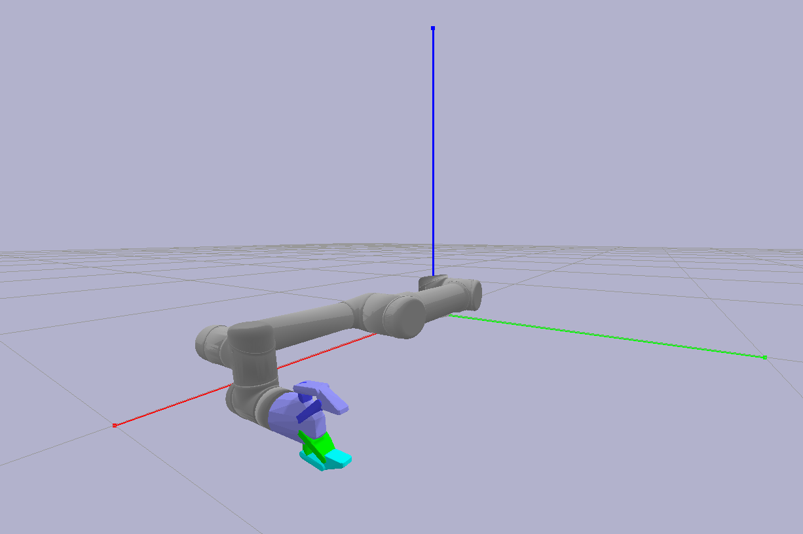

# CoSTAR Planner

[](https://travis-ci.com/cpaxton/costar_plan)

The CoSTAR Planner is part of the larger [CoSTAR project](https://github.com/cpaxton/costar_stack/). It integrates some learning from demonstration and task planning capabilities into the larger CoSTAR framework in different ways..

Specifically it is a project for creating task and motion planning algorithms that use machine learning to solve challenging problems in a variety of domains. This code provides a testbed for complex task and motion planning search algorithms. The goal is to describe example problems where actor must move around in the world and plan complex interactions with other actors or the environment that correspond to high-level symbolic states.

To run these examples, you will need TensorFlow and Keras, plus a number of Python packages. If you want to stick to the toy examples, you do not need to use this as a ROS package.

For some more information on the structure of the task planner package, check out the [design overview](docs/design.md).

Contents:
  - [Installation Guide](docs/install.md)
  - [Design Overview](docs/design.md)
  - [Development Notes](docs/development.md)
  - [Machine Learning Notes](docs/learning.md)
  - [Notes on installing Gazebo](docs/gazebo.md) -- may be out of date. PyBullet3 is now our preferred simulation environment.

## Getting started

Try setting up Bullet3. Then in python:

```
import costar_task_plan as ctp
import pybullet as pb

pb.connect(pb.GUI)
robot = ctp.simulation.robots.Ur5RobotiqRobotInterface()
task = ctp.simulation.tasks.SortingTaskDefinition(robot)
task.load()
```

And then interact as you would normally with the PyBullet interface.

## Problem Domains

  - Robotics: mimic an expert task performance in a new environment, or 
  - Grid World: navigate a busy road in a discrete grid task.
  - Needle Master: steer a needle through a sequence of gates while avoiding obstacles. In many ways this is a simplified driving problem, with an associated set of demonstrations.

### Robotics

These examples are designed to work with ROS and a simulation of the Universal Robots UR5, KUKA LBR iiwa, or other robot. ***NOTE THAT THIS FUNCTIONALITY IS STILL IN DEVELOPMENT.***



Our examples are based around the `costar_bullet` package, which uses the open-source Bullet simulator. To start, simply run:
```
rosrun costar_bullet start
```

You can run this with the `-h` or `--help` flag to get a list of potential arguments. The `start` command can be configured to bring up a robot and a task. For example, you may want to run:
```
rosrun costar_bullet start --robot ur5_robotiq --task blocks --gui
```
To bring up the standard CoSTAR UR5 with Robotiq 85 gripper, a block-stacking task, and a basic Bullet GUI to see things.

### Grid World

[](https://youtu.be/LLs1OIIIQnw)

Grid world is an ultra-simple driving task. The actor must move around a grid and navigate an intersection. Note that as the first domain implemented, this does not fully support the TTS API.

#### Run

```
create_training_data.py
learn_simple.py
```

### Needle Master

[](https://youtu.be/GgIznhbk-5g)

Example from a simple Android game. This comes with a dataset that can be used; the goal is to generate task and motion plans that align with the expert training data.

One sub-task from the Needle Master domain is trajectory optimization. The goal is to generate an optimal trajectory in the shortest possible amount of time.

## Contact

This code is maintained by Chris Paxton (cpaxton@jhu.edu).

