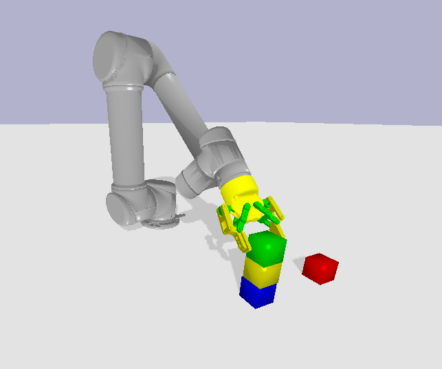

# CoSTAR Task Planner (CTP)

[](https://travis-ci.com/cpaxton/costar_plan)

The CoSTAR Planner is part of the larger [CoSTAR project](https://github.com/cpaxton/costar_stack/). It integrates some learning from demonstration and task planning capabilities into the larger CoSTAR framework in different ways..

Specifically it is a project for creating task and motion planning algorithms that use machine learning to solve challenging problems in a variety of domains. This code provides a testbed for complex task and motion planning search algorithms. The goal is to describe example problems where actor must move around in the world and plan complex interactions with other actors or the environment that correspond to high-level symbolic states.

To run these examples, you will need TensorFlow and Keras, plus a number of Python packages. If you want to stick to the toy examples, you do not need to use this as a ROS package.

For some more information on the structure of the task planner package, check out the [design overview](docs/design.md).

Contents:
  - [Installation Guide](docs/install.md)
  - [Docker Instructions](docs/docker_instructions.md)
  - [costar_bullet quick start](docs/costar_bullet.md): How to run tasks, generate datasets, train models, and extend costar_bullet with your own components.
  - [Design Overview](docs/design.md): for some high-level design choices related to the planning code
  - [Machine Learning Models](docs/learning.md): Available models and using the command line tool to train them
  - [Creating and training a custom task](docs/task_learning.md): defining a task, training predictive models and other tools

More specialized information:
  - [Adding a robot to the ROS code](docs/add_a_robot): NOT using Bullet sim
  - [TOM robot](docs/tom.md): use the TOM robot from TUM

## Getting started

First follow the [installation guide](docs/install.md) and then try running the simulation on your own. There are two ways of doing this: interactively, through `ipython`, or via the `costar_bullet` tool.

You can see the available parameters for `costar_bullet` with the command:

```
rosrun costar_bullet start --help
```

The easiest way to get started using line by line interactive programming is with either `ipython`
or the [xonsh shell](http://xon.sh). You can use the following sample code to bring up the robot with the simple "blocks" task.

```
import costar_task_plan as ctp
import pybullet as pb

# Create the simulation. Try switching out ur5 for a different robot or blocks
# for a different task.
sim = ctp.simulation.CostarBulletSimulation(robot="ur5", task="blocks", gui=True)

# Start the real-time simulation.
pb.setRealTimeSimulation(True)

# Move the arm around
sim.robot.arm([0,1,0,1,0,1])

# Control the gripper arbitrarily
sim.robot.gripper(0.5)

# Send the gripper to its closed position.
gripper_pos = sim.robot.gripperCloseCommand()
sim.robot.gripper(gripper_pos)
```

And then interact as you would normally with the PyBullet interface.

## Learning

The preferred way of interacting with the sim is through the `costar_bullet` tool:
```
rosrun costar_bullet start -h
```

For example, you can collect a dataset with the command:
```
rosrun costar_bullet start --robot ur5 --task blocks --agent task --features multi --save -i 10
```

And then learn a model with:
```
rosrun costar_bullet start --robot ur5  --features multi --load --model ff_regression
```

Different agents allow you to directly make the robot act in different ways.

## Problem Domains

The two primary domains are:
  - Bullet: simulation for various object manipulation tasks, generating task plans, etc.
  - Robotics: ROS version of the above, mostly focusing on the TOM robot.

We have some other domains as well, that do not fully support the CTP library:
  - Road World: drive down a busy road; 2D simulation with second-order dynamics. Not publicly released.
  - Grid World: navigate a busy road in a discrete grid task.
  - Needle Master: steer a needle through a sequence of gates while avoiding obstacles. In many ways this is a simplified driving problem, with an associated set of demonstrations.

More information on the [other domains](docs/domains.md) is available.


### Bullet

These examples are designed to work with ROS and a simulation of the Universal Robots UR5, KUKA LBR iiwa, or other robot. ***NOTE THAT THIS FUNCTIONALITY IS STILL IN DEVELOPMENT.***



Our examples are based around the `costar_bullet` package, which uses the open-source Bullet simulator. To start, simply run:
```
rosrun costar_bullet start
```

You can run this with the `-h` or `--help` flag to get a list of potential arguments. The `start` command can be configured to bring up a robot and a task. For example, you may want to run:
```
rosrun costar_bullet start --robot ur5_2_finger --task blocks --gui
```
To bring up the standard CoSTAR UR5 with Robotiq 85 gripper, a block-stacking task, and a basic Bullet GUI to see things.

## Contact

This code is maintained by Chris Paxton (cpaxton@jhu.edu).

