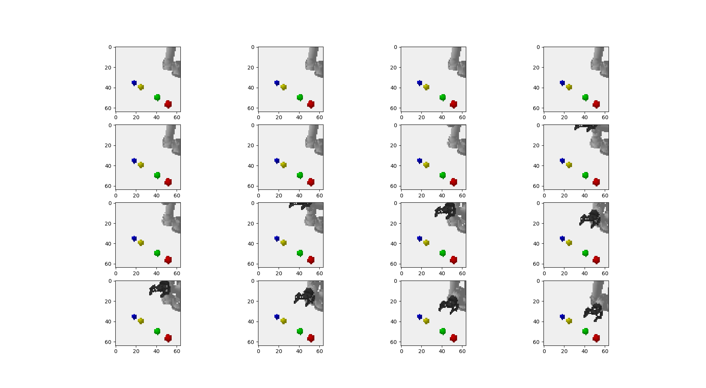
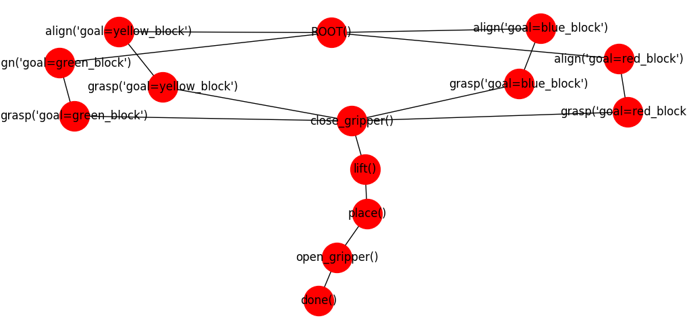
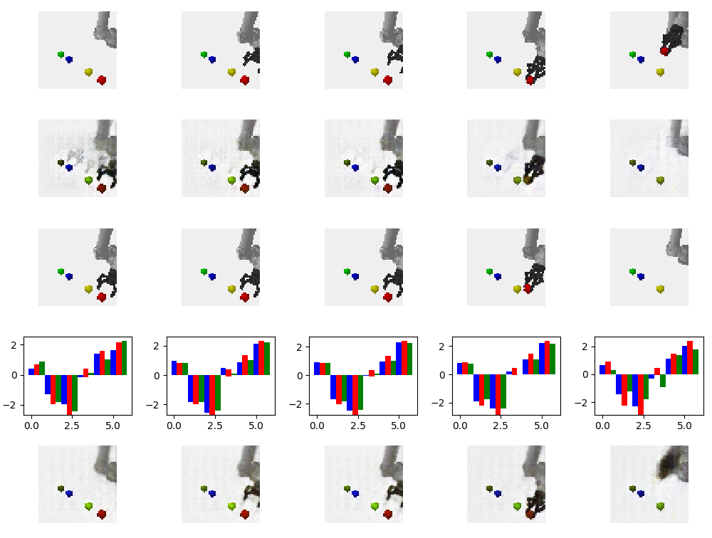

# Task Learning

The goal of our hierarchical task learning is to be able to use symbolic high-level planning grounded by learned neural net models of the world.

Our training data is sequences of task execution created with the `costar_bullet` simulation tool, as per the figure below.



The tool lets us generate large amounts of task performances, with randomized high level (and eventually low level) actions.

## Task Definition

The task is defined as a set of high- and low-level actions at various levels, given by a task plan such as that shown below. For now, we will consider the simple version of the "blocks" task.

Here, the robot can grab one of several blocks. Grabbing a block is divided between aligning, approaching, and closing the gripper. We wish to define a task architecture like this one:



The code below defines this simplest version of the task, creating both the action generators themselves (called "options"), and associated conditions. There are three differnt things we need to create:
  - options: these are the high-level actions; each one is a "generator" from which we can sample different policies and termination conditions.
  - arguments: these contain an option constructor, arguments, and an optional field to remap from these arguments to a part of the option constructor.
  - task: the task model itself.

The key parts of the Option are the constructor and the `samplePolicy(world)` function, which takes a current world and returns a policy functor and a condition.

The block of code below, taken from [CTP's Blocks task](costar_task_plan/python/costar_task_plan/simulation/tasks/blocks.py), defines the choice between different objects. Take a look at the [basic simulation options](costar_task_plan/python/costar_task_plan/simulation/tasks/blocks.py) for examples of options and the `samplePolicy()` function.

``` python
AlignOption = lambda goal: GoalDirectedMotionOption(
    self.world,
    goal,
    pose=((0.05, 0, 0.05), self.grasp_q),
    pose_tolerance=(0.03, 0.025),
    joint_velocity_tolerance=0.05,)
align_args = {
    "constructor": AlignOption,
    "args": ["block"],
    "remap": {"block": "goal"},
}
GraspOption = lambda goal: GoalDirectedMotionOption(
    self.world,
    goal,
    pose=((0.0, 0, 0.0), self.grasp_q),
    pose_tolerance=(0.03, 0.025),
    joint_velocity_tolerance=0.05,)
grasp_args = {
    "constructor": GraspOption,
    "args": ["block"],
    "remap": {"block": "goal"},
}
LiftOption = lambda: GeneralMotionOption(
    pose=(self.over_final_stack_pos, self.grasp_q),
    pose_tolerance=(0.05, 0.025),
    joint_velocity_tolerance=0.05,)
lift_args = {
    "constructor": LiftOption,
    "args": []
}
PlaceOption = lambda: GeneralMotionOption(
    pose=(self.final_stack_pos, self.grasp_q),
    pose_tolerance=(0.05, 0.025),
    joint_velocity_tolerance=0.05,)
place_args = {
    "constructor": PlaceOption,
    "args": []
}
close_gripper_args = {
    "constructor": CloseGripperOption,
    "args": []
}
open_gripper_args = {
    "constructor": OpenGripperOption,
    "args": []
}
```

When we create a task model, we use the `add(name, parent, arg_dict)` function. Its three parameters are:
  - `name`: name of the option
  - `parent`: name of the predecessor, or `None` if predecessor is root
  - `arg_dict`: dictionary containing constructor function, list of argument names, and optionally a `remap` dictionary from argument names to option constructor parameters.

```
# Create a task model
task = Task()
task.add("align", None, align_args)
task.add("grasp", "align", grasp_args)
task.add("close_gripper", "grasp", close_gripper_args)
task.add("lift", "close_gripper", lift_args)
task.add("place", "lift", place_args)
task.add("open_gripper", "place", open_gripper_args)
task.add("done", "open_gripper", lift_args)
```

We automatically call the `task.compile()` function to create the task model.

# Creating a Data Set

You can create a small data set in the normal way:

```
rosrun costar_bullet start --robot ur5 --task blocks --agent task \
  --features multi --save -i 10 --data_file small.npz
```

It might be helpful to make a larger training data set than this one, which is possible by changing the number of iterations as seen below.

```
rosrun costar_bullet start --robot ur5 --task blocks --agent task \
  --features multi --save -i 100 --data_file bigger.npz
```


# Learning

We can now use the standard CoSTAR bullet tool to train a model:
```
rosrun costar_bullet start --robot ur5 --task blocks --agent null --features multi \
  -i 1000 --model hierarchical --data_file small.npz --load --si 5 --lr 0.001
```

Replace the options as necessary. Interesting things to change:
  - `--lr` sets the learning rate
  - `--optimizer` changes the optimizer (try `nadam`, `sgd`, etc.)
  - `--si` or `--show_images` changes how often we display results
  - `-i` is iterations for training the predictor...
  - `-e` is epochs for fitting other models (used with the Keras `model.fit()` function)

It takes several thousand iterations to get this right. An example at about 500 iterations:



You should be able to see the model learning something useful fairly early on, at least with a small data set. It just won't be perfect.

# Testing

TODO
